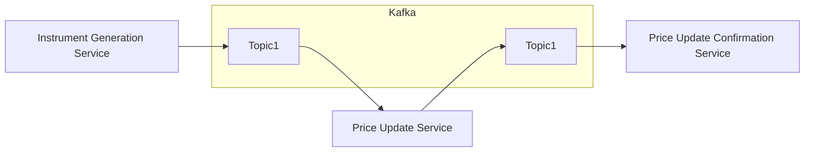

## Demo of Spring Cloud Data Flow Local Setup with Kafka-Binder


## Table of Contents

- [Introduction](#introduction)
- [Design](#design)
- [Prerequisites](#prerequisites)
- [Build](#build)
- [Run](#run)
- [References](#references)

### Introduction

This demonstration features the seamless integration of Spring Cloud Data Flow with Kafka-Binder, incorporating three
microservices that are interconnected over message broker establishing a cohesive data workflow/pipeline.

### Overview of Microservices

```
Generate Stock Instruments -> Update prices for the Stock Insruments -> Confirm the updated prices of the Stock Insruments
```

#### Instrument Generation Service

- Microservice Type: `Data source`
- Creates a random stock instrument object with the instrument's name at a frequency of 1 instrument every second.
- Produces this stock instrument as a message to a topic on the message broker.

#### Instrument Price Update Service

- Microservice Type: `Data processor`
- Listens to a topic on the message broker to receive instrument names.
- Updates the prices of stock instruments.
- Produces the updated stock instruments as a message to another topic on the message broker.

#### Instrument Price Update Confirmation Service

- Microservice Type: `Data sink`
- Listens to a topic on the message broker to receive stock instruments with updated prices.
- Writes the price update confirmation to the console (stdout).

### Overview of Spring Cloud Data Flow Setup

The microservices are configured and orchestrated using the Spring Cloud Data Flow framework.
Here's an overview of the
process:

#### Registration of Microservices

Microservices are registered as applications with the Spring Cloud Data Flow server.
The path to the executable JAR files is specified during registration.

#### Stream Creation

Streams (workflows/pipelines) are created using the registered applications.
A common configuration for using Kafka as a message broker is specified during stream creation.
This approach ensures consistency across all applications within the stream.

#### Deployment

Once a stream is created, it is deployed to initiate data processing.

The stream is setup with a common configuration to use Kafka as a message broker. This is not configured at each
application level, but instead specified at the time of creating a stream. This allows all the apps in the stream to
use the same Kafka configuration.

The docker-compose setup defines all the base services required to run the entire workflow.

### Design



### Prerequisites

- [Docker](https://www.docker.com/products/docker-desktop/)
- [Docker Compose](https://docs.docker.com/compose/)
- [make](https://formulae.brew.sh/formula/make)

### Build

```shell
make build
```

### Run Base Services 

```shell
make start-services
```

### Run SCDF Stream Services/Apps

```shell
make start
```

With all services up, access:

| Description                            | Link                            |
|----------------------------------------|---------------------------------|
| Kafka UI                               | http://localhost:8080           | 
| Grafana UI                             | http://localhost:3000           |                 
| Spring Cloud Data Flow Admin Dashboard | http://localhost:9393/dashboard |
| Spring Cloud Data Flow Skipper Server  | http://localhost:7577/api/      |
| Spring Cloud Data Flow Endpoints       | http://localhost:9393/          |

#### Images:

##### Spring Cloud Data Flow Dashboard: Registered Apps


##### Configured Streams


##### Stream Overview


##### Stream Apps Config


##### Stream App Logs


#### References:

- https://dataflow.spring.io/docs/installation/local/manual/
- https://dataflow.spring.io/docs/installation/local/docker/
- https://docs.spring.io/spring-cloud-dataflow/docs/current/reference/htmlsingle/#configuration-local-streams
- https://cloud.spring.io/spring-cloud-stream-binder-kafka/spring-cloud-stream-binder-kafka.html
